GodInfo 是一个功能全面的后渗透信息和凭据收集工具，旨在帮助安全测试人员在获得授权访问权限后，快速收集目标系统的信息和凭据。**本工具仅供安全测试人员在授权范围内使用，禁止用于任何非法活动。**

## 项目起源

在安全测试工作中，获取目标系统的详细信息和凭据是后渗透阶段的关键任务。现有的多种后渗透工具各有特点，但也存在功能分散、使用不便、兼容性差等问题。GodInfo 项目旨在整合和改进现有工具的功能，提供一个模块化、易用性强、功能全面的后渗透信息收集工具。本项目是对现有后渗透工具的整合和改进，主要参考了以下优秀项目：

- [SharpHunter](https://github.com/lintstar/SharpHunter)
- [Pillager](https://github.com/qwqdanchun/Pillager)
- [SharpDecryptPwd](https://github.com/RowTeam/SharpDecryptPwd)

## 使用方法

### 基本用法

```bash
GodInfo.exe <command> [options]
```

### 全量信息收集

```bash
GodInfo.exe all [-log] [-zip]
```

### 单项信息收集

```bash
# 系统信息收集
GodInfo.exe sys [-log] [-zip]

# 进程信息收集
GodInfo.exe pid [-log] [-zip]

# Chrome浏览器凭据收集
GodInfo.exe chrome [-log] [-zip]

# 更多命令请参考帮助信息
```

### 参数说明

- `-log`: 启用日志记录（结果将同时保存到文件）
- `-zip`: 启用ZIP打包（包含所有收集的信息，自动启用日志）

## 特点优势

- **整合优化**：整合多个优秀的后渗透工具功能，修复现有工具的缺陷和bug
- **模块化设计**：支持单一模块运行，增强使用的灵活性
- **易用性提升**：统一命令格式，增加交互式反馈，支持结果实时输出
- **全面覆盖**：涵盖主流应用程序的凭据收集功能
- **兼容性增强**：支持多版本应用程序的凭据提取

## 免责声明

**本工具仅供安全研究和授权测试使用。使用者必须遵守所在国家/地区的法律法规，并获得被测试系统所有者的明确授权。作者不对任何未授权、非法使用本工具的行为负责。**


## 更新日志

### ✅chrome

SharpHunter已经存在chrome 但是log默认不会显任何信息 只打包zip 所以增加了打印密码

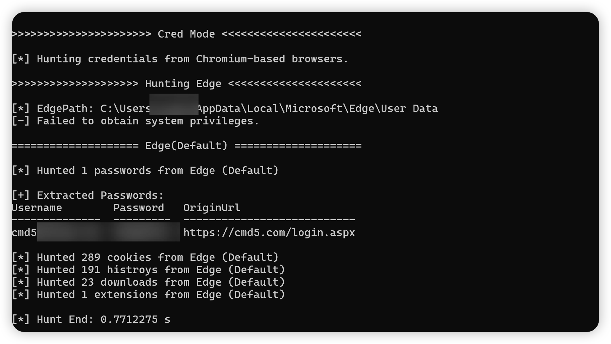

### ✅vpn

并没有实现自动解密，目前是查询有没有存储vpn，真遇到再说吧

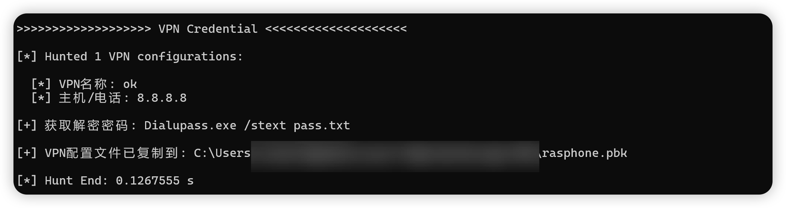

### ✅todesk优化

默认存在todesk模块，但是我发现兼容性不是很好，譬如AuthMode为-1,没有config.ini就不进行内存扫描，进程选择错误，密码判断错误等问题。

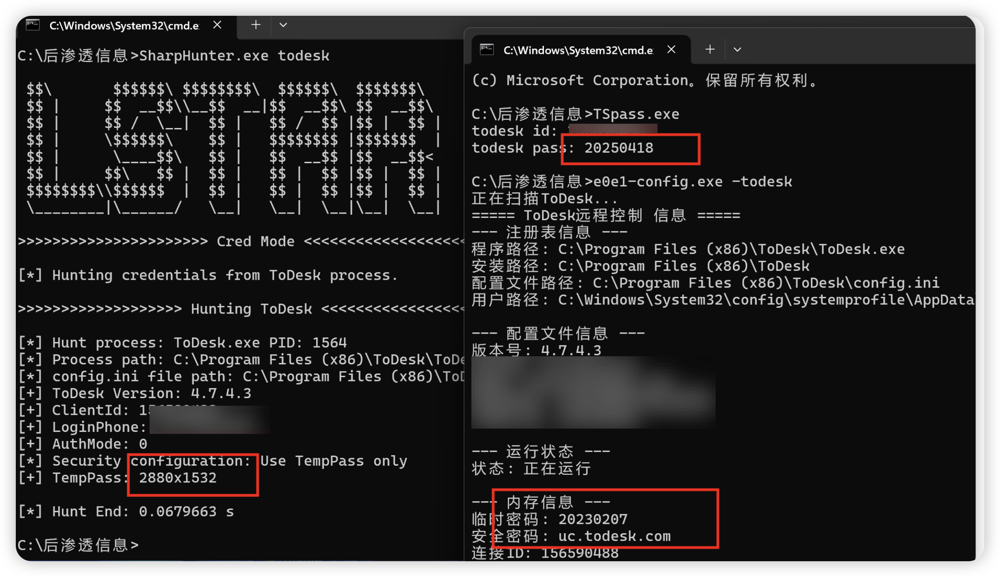

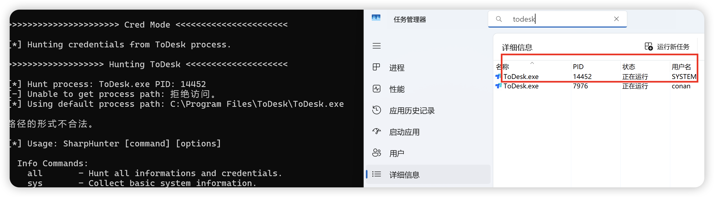

### ✅HeidiSQL

修复Pillager bug  ，lssues竟然没有提到，估计很少见。

var subKey = Registry.CurrentUser.OpenSubKey(subKeyName); 

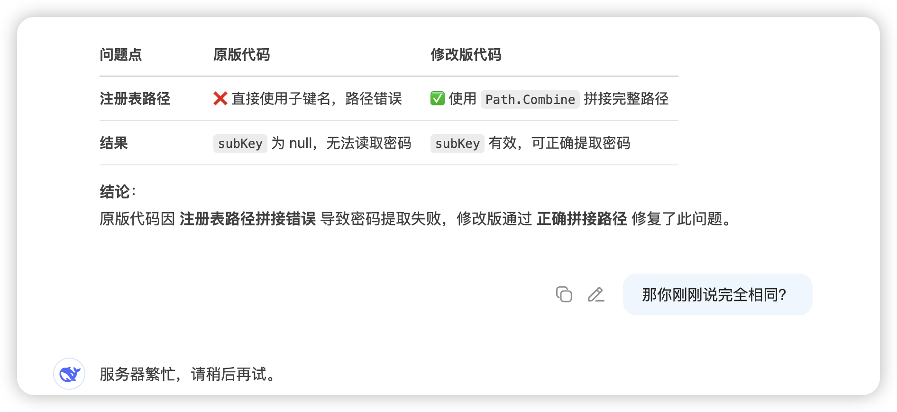

### ✅PLSQL

新增PL/SQL Developer解密，起因是某次内网遇到连接了40+，但好像很少有PL/SQL Developer解密的，最终找了一个Python的改了一下。

https://github.com/taylor8294/PLSQLDevPass

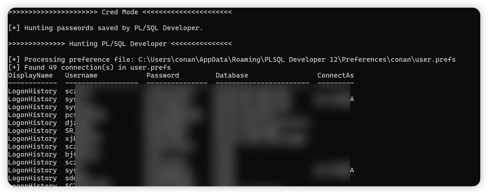

### ✅SecureCRT

支持v1 v2解密，虽然Pillager做了，但貌似v1存在bug，没细看。

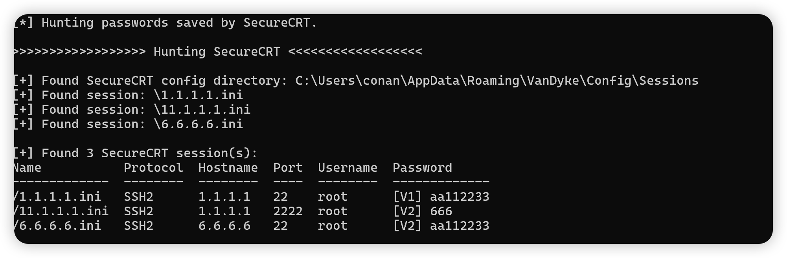

### ✅Xmanager

看了一下发现新版8与7相同的加密，于是增加一下 即可完成5-8的全版本解密

```c#
 else if (version.StartsWith("7") || version.StartsWith("8"))
```

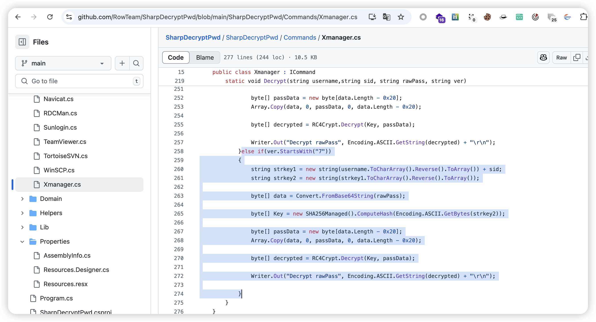

另外我发现都不加端口，如果是非标准端口咋整= =

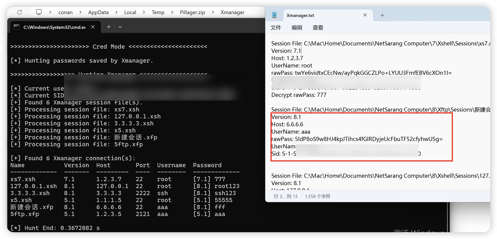

### ✅Windows 10 微软拼音输入法用户数据的收集

默认输出50条 全量在zip内

### ✅ClipBoard 剪贴板内容收集

AI直接新增如下，我就暂时保留了。

- 文本 (Text)

- 富文本 (RTF)

- HTML内容

- 图像 (Bitmap)

- 文件列表 (FileDrop)

### ✅TeamViewer

理论支持全版本（测试了13-15）

UI Interface，Memory Scan两种方式，显示对应版本 方便下载同目标版本进行连接。

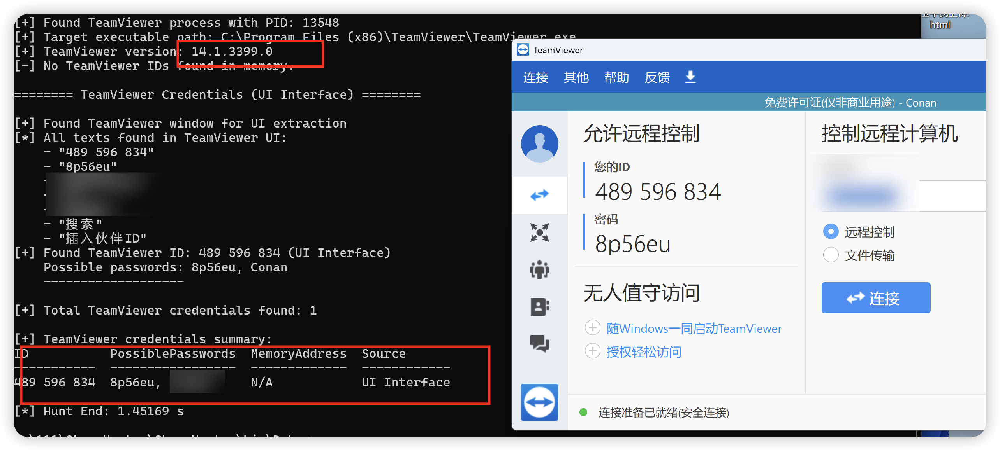

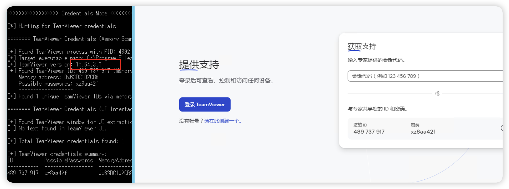

### ✅其他

firefox dbeaver filezilla WinSCP Navicat SQLyog  网易云音乐

直接参考的Pillager，并增加了打印

##  Info Commands

对于主机本身的信息收集，首先想到的是rdp和hash，这俩方面虽然很有必要，但我感觉都是需要采用多种方式的专项工具 如ShadowDumper，而不是简单的几个方法实现集成，所以并不打算加入。

除此之外，SharpHunter还算全面，还缺少一些收集。

### ✅sys增强

对于主机的基本信息，既然有了GetUserAccounts，那何必不新增一个QWinSta显示远程桌面会话信息。以及获取Windows Defender排除项 ，不妨把360白名单也新增一下。最终效果如下

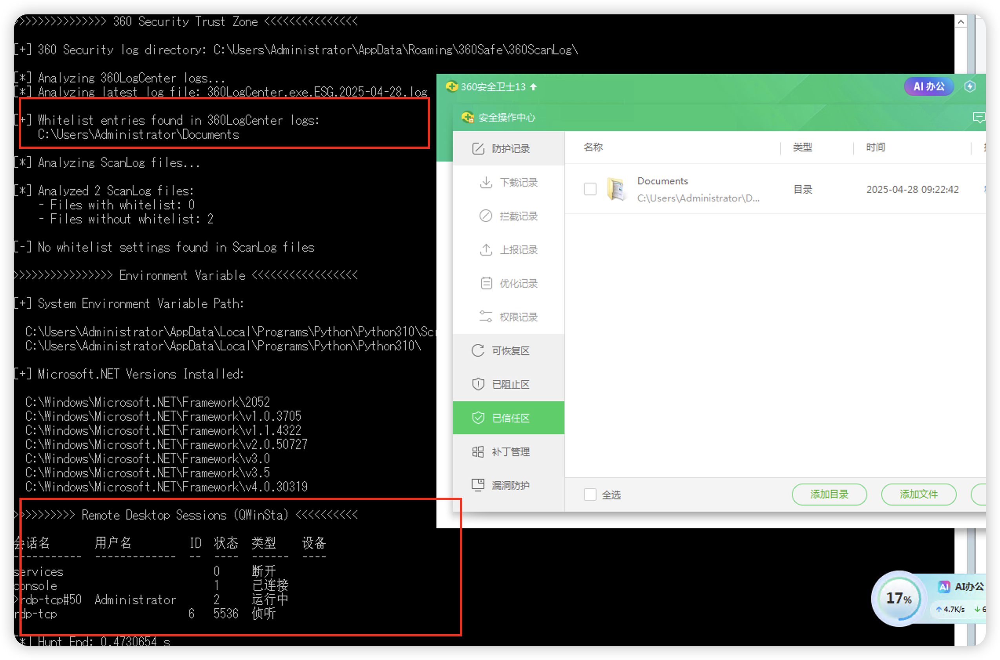

### ✅iis

方便直接获取iis站点信息，可控xx站群！！！[旺柴]

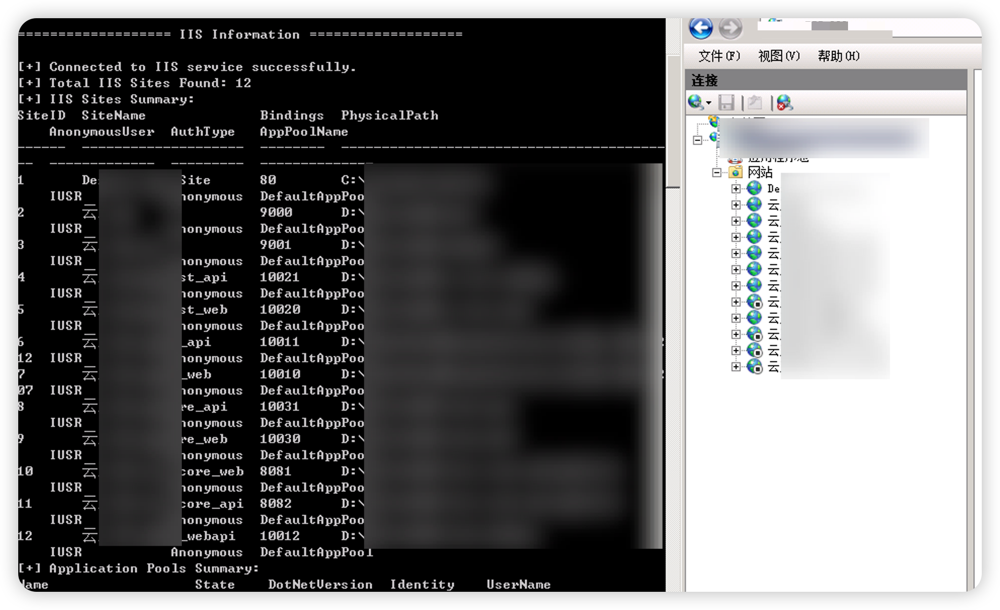

### ✅pid增强

Process（Hunting All 模式会输出 csv 文件）

默认输出详细信息，那不妨在详细一些，增加CommandLine对命令行参数的获取（遇到很多次jar起的服务会有很多敏感命令行参数）

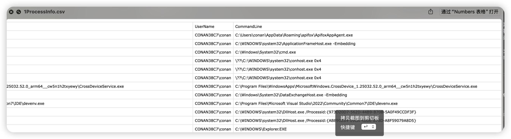

### ✅history

PowerShell和CMD的历史命令，没研究过，AI生成的，目前PowerShell是正常的。

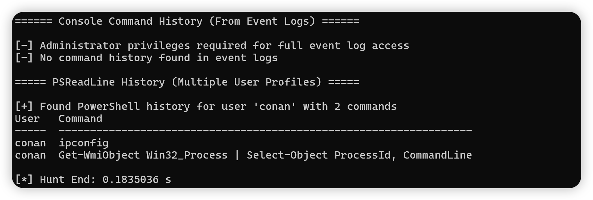

### ✅runmru

运行历史信息

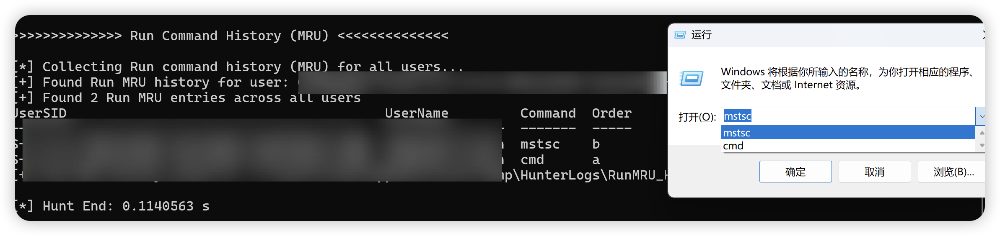

##  Post Commands

关于后渗透模块，计划是想删除的，因为本工具主要定位为内网凭据/信息收集，但目前的后渗透模块并没有太多攻击性，所以保留了下来，并新增了Regsam。

### ✅sam

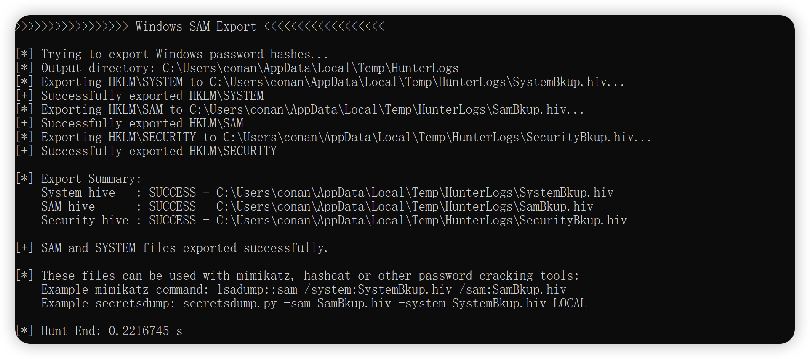


